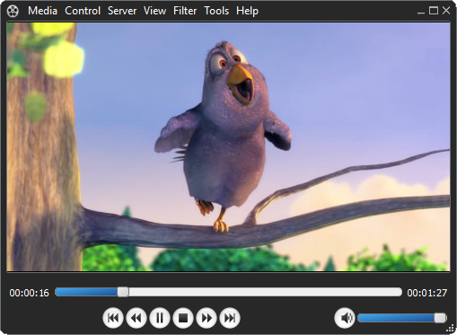
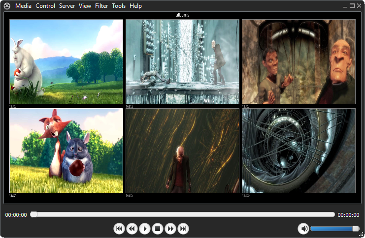
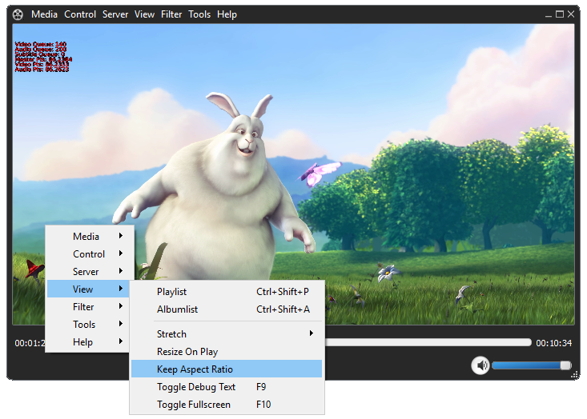

# MediaViewer

MediaViewer is a media player that can handle almost any format. It has built in support for TV-tuners and can handle multiple TV-tuners in the same channel list.
The built in client/server enables streaming of the content in the album list of the server instance and the TV-tuners channel list.

Play list feature allows adding and playing multiple files.
Album view feature allows adding and visualizing media files by adding directories to an album list. Each file and directory can be associated with a thumbnail.
Thumbnails can be created with the built in thumbnail creator. Album view supports input from keyboard, mouse or remote control.

The video renderer is written in OpenGL and color conversion from YUV to RGB is done with fragment shaders.
Image manipulation can be done with filters. Multiple filters can be chained together.

